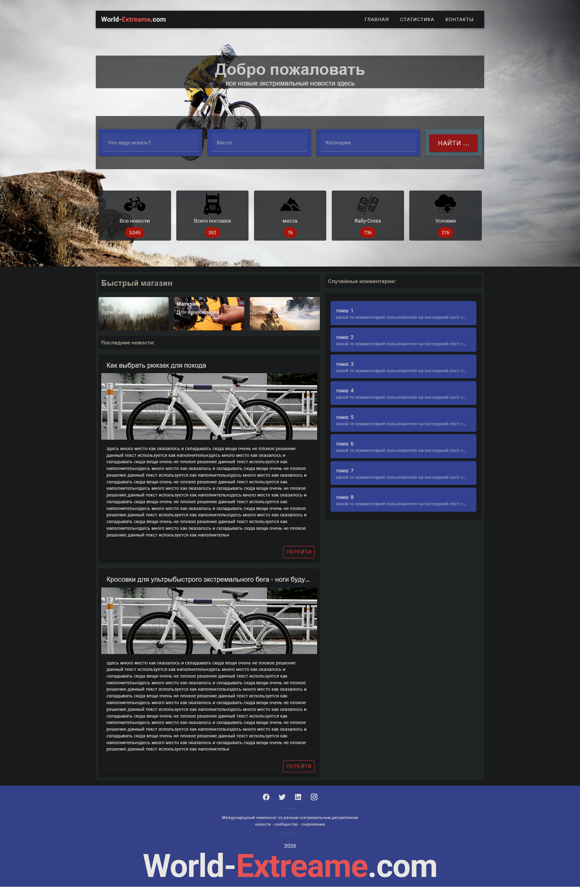

# 🌍 World Extreme Web-Application

Многофункциональное веб-приложение, построенное на современном стеке технологий:

- ⚡ **Frontend**: Vue 3 + TypeScript  
- 🔥 **Backend**: Laravel 12  
- 🐘 **Database**: PostgreSQL  
- 🐳 **Docker**: контейнеризация и простота развёртывания  

---

## 🚀 Старт проекта

### 1. Клонирование репозитория
```bash
git clone git@github.com:Viacheslav1998/world-extreame.git
or
git clone https://github.com/Viacheslav1998/world-extreame.git

cd world-extreame

### 2. сборка
docker-compose up -d --build
===

### 3. остановка контейнеров [малоли нужно]
docker-compose down
===

### 4. запуск контейнеров
===
docker-compose up -d

### 5. Linux / [wsl]
=== 

[0] docker exec -it laravel_app bash

#### поскольку это линукс нужно дать возможность писать и сохранять файлы
[1]sudo chown -R $USER:$USER . 
[1.1] cd ~/projects/world-extreame/backend
sudo chmod -R 777 storage bootstrap/cache // ради простого тестового проекта. для боевого так делать не надо.
[1.2] [backend] sudo chmod -R 777 database 
[1.3] docker compose exec app php artisan config:clear

#### выполнение команд без которых не стартанет проект
[2]
composer install
cp .env.example .env
php artisan key:generate
php artisan migrate

#### Установка зависимостей на фроненде
[3]
cd /frontend 
npm install
[wsl/linux не забуть выполнить
 sudo apt update 
 sudo apt install nodejs npm -y
 без пакетов не заработет npm
 и запускай vite
 npm run dev 
 ]

иногда надо обновить node.js


